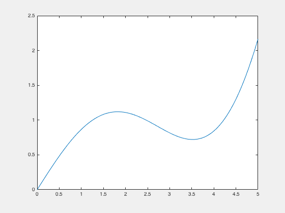

# AutoProof

### What is it?

Autoproof is a simple tool for getting guaranteed performance from MATLAB numerics code. You can use it to:

* Prove that code can never return Inf or NaN, or more generally can never return values outside specified bounds.

* Get accuracy and time bounds on code which uses unsafe algorithms like Newton-Raphson.

* Automate code generation, with a guarantee that the output meets accuracy and execution speed requirements.

### Quick tour
Lets warm up by proving something obvious. Start by defining a simple function:
```matlab
function y = example_function(x)
y = sin(x) + (x.^3)./4;
end
```
Plot this so we get an idea what it looks like:
```matlab
x = linspace(0, 5, 100);
plot(x, f(x))
```


